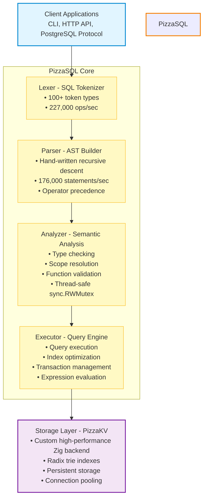

# PizzaSQL

<div align="center">

**A SQL database built from scratch in Go**

SQLite-compatible SQL · PostgreSQL wire protocol · HTTP/JSON API · Built-in storage

[](https://go.dev/)
[]()
[]()

[Features](#features) · [Quick Start](#quick-start) · [Documentation](#documentation) · [Benchmarks](#benchmarks)

</div>

---

## What is PizzaSQL?

PizzaSQL is a SQL database engine built from the ground up in Go. It features a hand-written recursive descent parser, SQLite-compatible SQL syntax, and multiple access methods.

PizzaSQL passes **100% of the SQLite SQLLogicTest suite** - over 5 million individual SQL tests covering edge cases, type coercion, complex queries, and SQLite compatibility.

### Access Methods

- **PostgreSQL Wire Protocol** - Connect with `psql`, any PostgreSQL client library (psycopg2, node-postgres, etc.)
- **HTTP/JSON API** - Query via REST endpoints from any language and the web
- **CLI & REPL** - Interactive shell and command-line execution

### Architecture

- **Hand-Written Lexer & Parser** - Pure Go implementation
- **PizzaKV Storage** - Custom high-performance Zig backend with radix trie indexes
- **Thread-Safe** - Concurrent query execution with mutex-based locking

PizzaSQL provides SQLite SQL compatibility with PostgreSQL wire protocol support, making it easy to integrate with existing tools and libraries while maintaining full control over the SQL dialect.

---

## Features

### Core SQL Operations

- Full CRUD: SELECT, INSERT, UPDATE, DELETE
- DDL: CREATE/DROP/ALTER TABLE, CREATE/DROP INDEX
- Joins: INNER, LEFT, RIGHT, FULL OUTER, CROSS
- Aggregation: COUNT, SUM, AVG, MIN, MAX with GROUP BY/HAVING
- Subqueries: Scalar, IN, EXISTS, and correlated subqueries
- Transactions: BEGIN, COMMIT, ROLLBACK, SAVEPOINT
- Advanced SQL: DISTINCT, ORDER BY, LIMIT/OFFSET, CASE expressions

### Multiple Access Methods

**PostgreSQL Wire Protocol**
```bash
# Start server
./pizzasql -pg -pg-port 5432

# Connect with psql
psql -h localhost -p 5432 -d pizzasql

# Or any PostgreSQL client library
postgresql://localhost:5432/pizzasql
```

**HTTP/JSON API**
```bash
# Start HTTP server
./pizzasql -http

# Query via REST
curl -X POST http://localhost:8080/query \
  -H "Content-Type: application/json" \
  -d '{"sql": "SELECT * FROM users WHERE age > ?", "params": [25]}'
```

**CLI/REPL**
```bash
# Interactive mode
./pizzasql

# Single statement
./pizzasql -e "SELECT * FROM users LIMIT 10"
```

### SQLite Compatibility

- ROWID Support - Implicit rowid column for all tables
- AUTOINCREMENT - Sequential ID generation
- Type Affinity - SQLite-compatible type system
- PRAGMA Statements - table_info, database_list, table_list, version
- SQLite Functions - printf, hex, random, glob, instr, zeroblob
- Conflict Resolution - INSERT OR REPLACE/IGNORE/FAIL/ABORT

### Performance & Architecture

- Hand-Written Parser - 176,000 statements/sec 
- Fast Lexer - 227,000 ops/sec tokenization
- Automatic Indexing - 10-100x faster than full table scans
- Thread-Safe - Concurrent query execution with mutex-based locking
- Connection Pooling - Efficient resource management

---

## Quick Start

### Installation

**Prerequisites:**
- Go 1.21+
- PizzaKV - Storage backend (auto-launched with `-kv` flag)

**Build from source:**
```bash
git clone https://github.com/danfragoso/pizzasql.git
cd pizzasql
make build
```

### Start the Server

**Option 1: HTTP API (recommended for web apps)**
```bash
# Auto-launch PizzaKV and start HTTP server
./pizzasql -http -kv

# Server available at http://localhost:8080
```

**Option 2: PostgreSQL Wire Protocol (recommended for existing PostgreSQL tools)**
```bash
# Auto-launch PizzaKV and start PostgreSQL-compatible server
./pizzasql -pg -kv

# Connect with psql
psql -h localhost -p 5432 -d pizzasql

# Or use any PostgreSQL client library
```

**Option 3: Interactive CLI**
```bash
# Auto-launch PizzaKV and start REPL
./pizzasql -kv
```

### Your First Query

**Using psql (PostgreSQL wire protocol):**
```sql
-- Connect
psql -h localhost -p 5432 -d pizzasql

-- Create table (SQLite syntax!)
CREATE TABLE users (
  id INTEGER PRIMARY KEY AUTOINCREMENT,
  name TEXT NOT NULL,
  email TEXT UNIQUE
);

-- Insert data
INSERT INTO users (name, email) VALUES 
  ('Alice', 'alice@example.com'),
  ('Bob', 'bob@example.com');

-- Query
SELECT * FROM users;
```

**Using HTTP API:**
```bash
# Create table
curl -X POST http://localhost:8080/query \
  -H "Content-Type: application/json" \
  -d '{
    "sql": "CREATE TABLE users (id INTEGER PRIMARY KEY, name TEXT, email TEXT)"
  }'

# Insert with parameters
curl -X POST http://localhost:8080/query \
  -H "Content-Type: application/json" \
  -d '{
    "sql": "INSERT INTO users (name, email) VALUES (?, ?)",
    "params": ["Alice", "alice@example.com"]
  }'

# Query
curl -X POST http://localhost:8080/query \
  -H "Content-Type: application/json" \
  -d '{
    "sql": "SELECT * FROM users WHERE name = ?",
    "params": ["Alice"]
  }'
```

**Response:**
```json
{
  "columns": [
    {"name": "id", "type": "INTEGER"},
    {"name": "name", "type": "TEXT"},
    {"name": "email", "type": "TEXT"}
  ],
  "rows": [
    [1, "Alice", "alice@example.com"]
  ],
  "rowsAffected": 0,
  "lastInsertId": 0,
  "executionTime": "1.234ms"
}
```

---

## Benchmarks

Performance comparison between PizzaSQL, SQLite, and PostgreSQL.

| Operation | SQLite | PizzaSQL (HTTP) | PizzaSQL (PG Wire) | PostgreSQL |
|-----------|--------|-----------------|--------------------|------------|
| **INSERT (1000 rows)** | 308 ops/s | 138 ops/s | 5780 ops/s | 12820 ops/s |
| **SELECT (no index)** | 288 q/s | 128 q/s | 165 q/s | 414 q/s |
| **CREATE INDEX** | 6 ms | 69 ms | 63 ms | 31 ms |
| **SELECT (indexed)** | 318 q/s | 136 q/s | 1562 q/s | 2222 q/s |
| **AGGREGATE** | 313 q/s | 137 q/s | 1052 q/s | 980 q/s |

**Note:** Wire protocol benchmarks (PizzaSQL PG Wire and PostgreSQL) use connection reuse with transactions, which is what client libraries do automatically. PizzaSQL's aggregate queries outperform PostgreSQL in this benchmark.

### Run Your Own Benchmarks

```bash
./benchmarks/quick_bench.sh
```

---

## PostgreSQL Wire Protocol Support

PizzaSQL implements the PostgreSQL wire protocol, allowing you to connect with any PostgreSQL client while using SQLite-compatible SQL syntax.

### Protocol Features

- **Universal compatibility** - Works with thousands of PostgreSQL tools and libraries
- **SQLite simplicity** - No complex types, permissions, or schemas to manage
- **Binary protocol** - Efficient data transfer

### Connecting with Client Libraries

**Python (psycopg2):**
```python
import psycopg2

# Connect to PizzaSQL
conn = psycopg2.connect(
    host="localhost",
    port=5432,
    database="pizzasql"
)

# Use SQLite-compatible SQL
cur = conn.cursor()
cur.execute("""
    CREATE TABLE users (
        id INTEGER PRIMARY KEY AUTOINCREMENT,
        name TEXT NOT NULL,
        email TEXT
    )
""")

# Parameterized queries work as expected
cur.execute("INSERT INTO users (name, email) VALUES (%s, %s)", 
            ("Alice", "alice@example.com"))

# Query results
cur.execute("SELECT * FROM users WHERE name = %s", ("Alice",))
rows = cur.fetchall()
for row in rows:
    print(row)

conn.commit()
conn.close()
```

**Node.js (node-postgres):**
```javascript
const { Client } = require('pg');

// Connect to PizzaSQL
const client = new Client({
  host: 'localhost',
  port: 5432,
  database: 'pizzasql'
});

await client.connect();

// Use SQLite-compatible SQL
await client.query(`
  CREATE TABLE users (
    id INTEGER PRIMARY KEY AUTOINCREMENT,
    name TEXT NOT NULL,
    email TEXT
  )
`);

// Parameterized queries
await client.query(
  'INSERT INTO users (name, email) VALUES ($1, $2)',
  ['Alice', 'alice@example.com']
);

// Query results
const res = await client.query(
  'SELECT * FROM users WHERE name = $1',
  ['Alice']
);
console.log(res.rows);

await client.end();
```

**Go (lib/pq):**
```go
package main

import (
    "database/sql"
    _ "github.com/lib/pq"
)

func main() {
    // Connect to PizzaSQL
    db, err := sql.Open("postgres", 
        "host=localhost port=5432 dbname=pizzasql sslmode=disable")
    if err != nil {
        panic(err)
    }
    defer db.Close()

    // Use SQLite-compatible SQL
    _, err = db.Exec(`
        CREATE TABLE users (
            id INTEGER PRIMARY KEY AUTOINCREMENT,
            name TEXT NOT NULL,
            email TEXT
        )
    `)

    // Parameterized queries
    _, err = db.Exec(
        "INSERT INTO users (name, email) VALUES ($1, $2)",
        "Alice", "alice@example.com")

    // Query results
    rows, err := db.Query(
        "SELECT * FROM users WHERE name = $1",
        "Alice")
    defer rows.Close()

    for rows.Next() {
        var id int
        var name, email string
        rows.Scan(&id, &name, &email)
        fmt.Printf("%d: %s (%s)\n", id, name, email)
    }
}
```

**Ruby (pg gem):**
```ruby
require 'pg'

# Connect to PizzaSQL
conn = PG.connect(
  host: 'localhost',
  port: 5432,
  dbname: 'pizzasql'
)

# Use SQLite-compatible SQL
conn.exec(<<-SQL)
  CREATE TABLE users (
    id INTEGER PRIMARY KEY AUTOINCREMENT,
    name TEXT NOT NULL,
    email TEXT
  )
SQL

# Parameterized queries
conn.exec_params(
  'INSERT INTO users (name, email) VALUES ($1, $2)',
  ['Alice', 'alice@example.com']
)

# Query results
result = conn.exec_params(
  'SELECT * FROM users WHERE name = $1',
  ['Alice']
)

result.each do |row|
  puts "#{row['id']}: #{row['name']} (#{row['email']})"
end

conn.close
```

**PHP (PDO):**
```php
<?php
// Connect to PizzaSQL
$dsn = "pgsql:host=localhost;port=5432;dbname=pizzasql";
$pdo = new PDO($dsn);

// Use SQLite-compatible SQL
$pdo->exec("
    CREATE TABLE users (
        id INTEGER PRIMARY KEY AUTOINCREMENT,
        name TEXT NOT NULL,
        email TEXT
    )
");

// Parameterized queries
$stmt = $pdo->prepare(
    "INSERT INTO users (name, email) VALUES (?, ?)"
);
$stmt->execute(['Alice', 'alice@example.com']);

// Query results
$stmt = $pdo->prepare(
    "SELECT * FROM users WHERE name = ?"
);
$stmt->execute(['Alice']);
$rows = $stmt->fetchAll(PDO::FETCH_ASSOC);

foreach ($rows as $row) {
    echo "{$row['id']}: {$row['name']} ({$row['email']})\n";
}
?>
```

**Rust (tokio-postgres):**
```rust
use tokio_postgres::{NoTls, Error};

#[tokio::main]
async fn main() -> Result<(), Error> {
    // Connect to PizzaSQL
    let (client, connection) = tokio_postgres::connect(
        "host=localhost port=5432 dbname=pizzasql", 
        NoTls
    ).await?;

    tokio::spawn(async move {
        if let Err(e) = connection.await {
            eprintln!("connection error: {}", e);
        }
    });

    // Use SQLite-compatible SQL
    client.execute(
        "CREATE TABLE users (
            id INTEGER PRIMARY KEY AUTOINCREMENT,
            name TEXT NOT NULL,
            email TEXT
        )", &[]
    ).await?;

    // Parameterized queries
    client.execute(
        "INSERT INTO users (name, email) VALUES ($1, $2)",
        &[&"Alice", &"alice@example.com"]
    ).await?;

    // Query results
    let rows = client.query(
        "SELECT * FROM users WHERE name = $1",
        &[&"Alice"]
    ).await?;

    for row in rows {
        let id: i32 = row.get(0);
        let name: &str = row.get(1);
        let email: &str = row.get(2);
        println!("{}: {} ({})", id, name, email);
    }

    Ok(())
}
```

### Command-Line Tools

**psql (PostgreSQL CLI):**
```bash
# Connect interactively
psql -h localhost -p 5432 -d pizzasql

# Execute single command
psql -h localhost -p 5432 -d pizzasql \
  -c "SELECT * FROM users WHERE age > 25"

# Execute SQL file
psql -h localhost -p 5432 -d pizzasql -f schema.sql

# CSV output
psql -h localhost -p 5432 -d pizzasql \
  -c "SELECT * FROM users" --csv > users.csv
```

**pgcli (Enhanced PostgreSQL CLI):**
```bash
pgcli postgresql://localhost:5432/pizzasql
```

**DBeaver, pgAdmin, DataGrip:**
- Connection type: PostgreSQL
- Host: localhost
- Port: 5432
- Database: pizzasql
- No username/password required

### Important Notes

1. **SQL Dialect**: PizzaSQL uses **SQLite SQL syntax**, not PostgreSQL syntax
   - Use `INTEGER PRIMARY KEY AUTOINCREMENT`, not `SERIAL`
   - Use `TEXT` type, not `VARCHAR` with enforced length
   - SQLite type affinity rules apply

2. **Parameter Placeholders**: Client libraries use their standard placeholders
   - Python/Node.js: `$1, $2, $3...`
   - Go: `$1, $2, $3...`
   - PHP: `?` or named parameters
   - These are automatically converted to PizzaSQL's `?` placeholder

3. **Compatibility**: Works with PostgreSQL clients, not PostgreSQL-specific features
   - No schemas, roles, or permissions
   - No PostgreSQL-specific types (ARRAY, JSON, etc.)
   - Use SQLite functions, not PostgreSQL functions

---

## Architecture

PizzaSQL is built with a clean, modular architecture that processes SQL queries through distinct stages:


```mermaid
graph TD
    Client[Client Applications<br/>CLI, HTTP API, PostgreSQL Protocol]

    Client --> Lexer

    subgraph PizzaSQL Core
        Lexer[Lexer - SQL Tokenizer<br/>• 100+ token types<br/>• 227,000 ops/sec]
        Parser[Parser - AST Builder<br/>• Hand-written recursive descent<br/>• 176,000 statements/sec<br/>• Operator precedence]
        Analyzer[Analyzer - Semantic Analysis<br/>• Type checking<br/>• Scope resolution<br/>• Function validation<br/>• Thread-safe sync.RWMutex]
        Executor[Executor - Query Engine<br/>• Query execution<br/>• Index optimization<br/>• Transaction management<br/>• Expression evaluation]

        Lexer --> Parser
        Parser --> Analyzer
        Analyzer --> Executor
    end

    Executor --> Storage[Storage Layer - PizzaKV<br/>• Custom high-performance Zig backend<br/>• Radix trie indexes<br/>• Persistent storage<br/>• Connection pooling]

    style Client fill:#e1f5ff,stroke:#0288d1,stroke-width:2px
    style PizzaSQL Core fill:#fff3e0,stroke:#f57c00,stroke-width:2px
    style Storage fill:#f3e5f5,stroke:#7b1fa2,stroke-width:2px
    style Lexer fill:#fff9c4,stroke:#fbc02d
    style Parser fill:#fff9c4,stroke:#fbc02d
    style Analyzer fill:#fff9c4,stroke:#fbc02d
    style Executor fill:#fff9c4,stroke:#fbc02d
```

---

## Documentation

### CLI Usage

**Interactive REPL:**
```bash
./pizzasql -kv
```

Built-in commands:
- `help` - Show available commands
- `quit` - Exit the REPL
- `tables` - List all tables
- `clear` - Clear screen

**Single Statement:**
```bash
./pizzasql -e "SELECT * FROM users LIMIT 10"
```

**Piped Input:**
```bash
cat schema.sql | ./pizzasql
```

**Expression-Only Mode:**
```bash
./pizzasql -e "SELECT 2 + 2 * 10"
# Result: 22
```

### HTTP API

#### POST /query - Execute SQL Query

```bash
curl -X POST http://localhost:8080/query \
  -H "Content-Type: application/json" \
  -d '{
    "sql": "SELECT * FROM users WHERE age > ?",
    "params": [25]
  }'
```

Response:
```json
{
  "columns": [
    {"name": "id", "type": "INTEGER"},
    {"name": "name", "type": "TEXT"}
  ],
  "rows": [[1, "Alice"], [2, "Bob"]],
  "rowsAffected": 0,
  "lastInsertId": 0,
  "executionTime": "1.2ms"
}
```

#### POST /execute - Batch Execution

```bash
curl -X POST http://localhost:8080/execute \
  -H "Content-Type: application/json" \
  -d '{
    "statements": [
      {"sql": "INSERT INTO users (name) VALUES (?)", "params": ["Alice"]},
      {"sql": "INSERT INTO users (name) VALUES (?)", "params": ["Bob"]}
    ],
    "transaction": true
  }'
```

#### GET /schema/tables - List Tables

```bash
curl http://localhost:8080/schema/tables
```

#### GET /schema/tables/{name} - Table Schema

```bash
curl http://localhost:8080/schema/tables/users
```

#### GET /health - Health Check

```bash
curl http://localhost:8080/health
```

#### GET /metrics - Prometheus Metrics

```bash
curl http://localhost:8080/metrics
```

### Database Export/Import

**Export entire database:**
```bash
./pizzasql -db mydb -o backup.sql
```

**Export with DROP TABLE statements:**
```bash
./pizzasql -db mydb -o backup.sql -drop
```

**Export specific table:**
```bash
./pizzasql -db mydb -table users -o users.sql
```

**Export to CSV:**
```bash
./pizzasql -db mydb -table users -o users.csv
```

**Import SQL file:**
```bash
./pizzasql -db mydb -i backup.sql
```

**Import CSV:**
```bash
./pizzasql -db mydb -table users -i users.csv -create-table
```

### SQL Support

**Data Types:**
- `INTEGER` (INT, SMALLINT, BIGINT, BOOLEAN)
- `REAL` (FLOAT, DOUBLE, DECIMAL)
- `TEXT` (VARCHAR, CHAR, CHARACTER)
- `BLOB` (binary data)
- `NUMERIC` (flexible numeric)

**Joins:**
- INNER JOIN
- LEFT JOIN / LEFT OUTER JOIN
- RIGHT JOIN / RIGHT OUTER JOIN
- FULL OUTER JOIN
- CROSS JOIN

**Aggregates:**
- COUNT, COUNT(DISTINCT)
- SUM, AVG, MIN, MAX

**Functions:**
- String: UPPER, LOWER, LENGTH, SUBSTR, TRIM, REPLACE, CONCAT
- Numeric: ABS, ROUND, CEIL, FLOOR, MOD
- Null handling: COALESCE, NULLIF, IFNULL
- SQLite: printf, hex, random, glob, instr, zeroblob

**Transaction Support:**
```sql
BEGIN;
INSERT INTO accounts (name, balance) VALUES ('Alice', 1000);
UPDATE accounts SET balance = balance - 100 WHERE name = 'Alice';
COMMIT;

-- Rollback on error
BEGIN;
UPDATE accounts SET balance = balance - 100 WHERE name = 'Alice';
ROLLBACK;

-- Savepoints
BEGIN;
INSERT INTO users (name) VALUES ('Alice');
SAVEPOINT sp1;
INSERT INTO users (name) VALUES ('Bob');
ROLLBACK TO SAVEPOINT sp1;
COMMIT;
```

**Indexes:**
```sql
-- Create index
CREATE INDEX idx_users_email ON users(email);

-- Multi-column index
CREATE INDEX idx_orders_user_date ON orders(user_id, created_at);

-- Unique index
CREATE UNIQUE INDEX idx_users_email ON users(email);

-- Drop index
DROP INDEX idx_users_email;
```

**PRAGMA Statements:**
```sql
-- Table schema
PRAGMA table_info(users);

-- List tables
PRAGMA table_list;

-- Database list
PRAGMA database_list;

-- Version
PRAGMA version;
```

**Query Plans:**
```sql
-- Show execution plan
EXPLAIN SELECT * FROM users WHERE id = 1;

-- Detailed query plan
EXPLAIN QUERY PLAN SELECT * FROM users WHERE id = 1;
```

### Configuration

**Command-Line Options:**
```bash
# Database options
-kvaddr string    PizzaKV server address (default "localhost:8085")
-kv               Launch PizzaKV automatically
-kvflags string   Flags to pass to PizzaKV (e.g., "-iwal -port=9090")
-db string        Database name (default "pizzasql")
-e string         Execute single statement and exit

# PostgreSQL server options
-pg               Enable PostgreSQL wire protocol server
-pg-host string   PostgreSQL server host (default "localhost")
-pg-port int      PostgreSQL server port (default 5432)

# HTTP server options
-http             Start HTTP server
-http-host string HTTP server host (default "localhost")
-http-port int    HTTP server port (default 8080)
-http-cors        Enable CORS headers
-http-auth        Enable authentication
-api-keys string  Comma-separated API keys

# Export/Import options
-o string         Output file for export
-i string         Input file for import
-table string     Specific table to export/import
-format string    Export/import format: sql, csv
-drop             Include DROP TABLE statements in export
-create-table     Create table if not exists (CSV import)
-ignore-errors    Continue import on errors

# Other options
-version          Print version and exit
-help             Show help message
-quiet            Disable query logging
```

---

## Testing

PizzaSQL has comprehensive test coverage across all components.

### Running Tests

```bash
# All tests
make test

# Specific component
make test-lexer
make test-parser
go test ./pkg/analyzer/...
go test ./pkg/executor/...

# With verbose output
make test-v

# With coverage report
make test-cover
open coverage.html

# With race detection
make test-race

# Benchmarks
make bench
```

### Test Coverage

| Component | Coverage | Test Count |
|-----------|----------|------------|
| Lexer | ~95% | 15 test functions |
| Parser | ~90% | 35+ test functions |
| Analyzer | ~85% | 20+ test functions |
| Executor | ~80% | 25+ test functions |
| HTTP Server | ~75% | 15+ test functions |
| PostgreSQL Server | ~70% | 10+ test functions |

### SQLLogicTest

PizzaSQL passes **100% of the SQLite SQLLogicTest suite** - over 5 million individual SQL tests. This comprehensive test suite validates:

- Complex SQL query correctness
- SQLite compatibility and edge cases
- Type coercion and affinity
- Aggregates and joins
- Transaction semantics
- Index optimization
