# PizzaSQL 🍕

**A fast, SQLite-compatible SQL database built from scratch in Go**

PizzaSQL is a SQL-92 compliant database with SQLite compatibility, featuring a hand-written recursive descent parser and using PizzaKV as its storage backend. It provides both a CLI interface and a full-featured HTTP/JSON API for easy integration with any programming language.

[](https://go.dev/)
[]()
[]()

---

## Table of Contents

- [Features](#features)
- [Architecture](#architecture)
- [Performance](#performance)
- [Installation](#installation)
- [Quick Start](#quick-start)
- [CLI Usage](#cli-usage)
- [HTTP API](#http-api)
- [SQL Support](#sql-support)
- [Testing](#testing)
- [How It Works](#how-it-works)
- [SQLite Compatibility](#sqlite-compatibility)
- [Roadmap](#roadmap)
- [Contributing](#contributing)

---

## Features

### Core SQL Features

- ✅ **Full CRUD Operations**: SELECT, INSERT, UPDATE, DELETE
- ✅ **Table Management**: CREATE TABLE, DROP TABLE, ALTER TABLE
- ✅ **Joins**: INNER, LEFT, RIGHT, FULL OUTER, CROSS
- ✅ **Aggregation**: COUNT, SUM, AVG, MIN, MAX with GROUP BY/HAVING
- ✅ **Subqueries**: Scalar, IN, EXISTS, and correlated subqueries
- ✅ **Indexes**: CREATE INDEX, DROP INDEX with automatic optimization
- ✅ **Transactions**: BEGIN, COMMIT, ROLLBACK, SAVEPOINT
- ✅ **Advanced SQL**: DISTINCT, ORDER BY, LIMIT/OFFSET, CASE expressions
- ✅ **String Functions**: UPPER, LOWER, LENGTH, SUBSTR, TRIM, REPLACE, CONCAT
- ✅ **Numeric Functions**: ABS, ROUND, CEIL, FLOOR, MOD
- ✅ **Null Handling**: COALESCE, NULLIF, IFNULL, IS NULL

### SQLite Compatibility

- ✅ **ROWID Support**: Implicit rowid column for all tables
- ✅ **AUTOINCREMENT**: Sequential ID generation
- ✅ **PRAGMA Statements**: table_info, database_list, table_list, version
- ✅ **EXPLAIN**: Query execution plan visualization
- ✅ **SQLite Functions**: printf, hex, random, glob, instr, zeroblob
- ✅ **Conflict Resolution**: INSERT OR REPLACE/IGNORE/FAIL/ABORT

### HTTP/JSON API

- ✅ **RESTful Endpoints**: Execute queries via HTTP POST
- ✅ **Parameterized Queries**: Prevent SQL injection with ? placeholders
- ✅ **Batch Execution**: Run multiple statements in transactions
- ✅ **Schema Introspection**: List tables and inspect schemas
- ✅ **Authentication**: Bearer token API key support
- ✅ **CORS Support**: Browser-compatible cross-origin requests
- ✅ **Response Compression**: gzip for large result sets
- ✅ **Prometheus Metrics**: Monitor queries, performance, and health
- ✅ **Import/Export**: Backup and restore databases via SQL files

### Advanced Features

- ✅ **Thread-Safe**: Concurrent query execution with mutex-based locking
- ✅ **Connection Pooling**: Efficient resource management
- ✅ **Type System**: SQLite-compatible type affinity (INTEGER, REAL, TEXT, BLOB, NUMERIC)
- ✅ **Query Optimization**: Automatic index usage for WHERE clauses
- ✅ **Multi-Database**: ATTACH/DETACH database support
- ✅ **Expression Evaluation**: Full support for arithmetic, comparison, and logical operations

---

## Architecture

PizzaSQL is built with a clean, modular architecture:

```mermaid
graph TD
    Client[Client Applications<br/>CLI, HTTP API, Go programs]

    Client --> Lexer

    subgraph PizzaSQL Core
        Lexer[Lexer - SQL Tokenizer<br/>• 100+ token types<br/>• 227,000 ops/sec]
        Parser[Parser - AST Builder<br/>• Recursive descent<br/>• 176,000 statements/sec<br/>• Operator precedence]
        Analyzer[Analyzer - Semantic Analysis<br/>• Type checking<br/>• Scope resolution<br/>• Function validation<br/>• Thread-safe sync.RWMutex]
        Executor[Executor - Query Engine<br/>• Query execution<br/>• Index optimization<br/>• Transaction management<br/>• Expression evaluation]

        Lexer --> Parser
        Parser --> Analyzer
        Analyzer --> Executor
    end

    Executor --> Storage[Storage Layer - PizzaKV<br/>• Key-value store with radix trie<br/>• Persistent storage<br/>• Connection pooling]

    style Client fill:#e1f5ff,stroke:#0288d1,stroke-width:2px
    style PizzaSQL Core fill:#fff3e0,stroke:#f57c00,stroke-width:2px
    style Storage fill:#f3e5f5,stroke:#7b1fa2,stroke-width:2px
    style Lexer fill:#fff9c4,stroke:#fbc02d
    style Parser fill:#fff9c4,stroke:#fbc02d
    style Analyzer fill:#fff9c4,stroke:#fbc02d
    style Executor fill:#fff9c4,stroke:#fbc02d
```



**Key Components:**

1. **Lexer** (`pkg/lexer`): Tokenizes SQL statements into a stream of tokens
2. **Parser** (`pkg/parser`): Builds Abstract Syntax Trees (AST) from tokens
3. **Analyzer** (`pkg/analyzer`): Performs semantic analysis and type checking
4. **Executor** (`pkg/executor`): Executes queries and manages transactions
5. **Storage** (`pkg/storage`): Interfaces with PizzaKV for data persistence
6. **HTTP Server** (`pkg/httpserver`): Provides REST API endpoints

---

## Performance

PizzaSQL is designed for speed:

| Component | Performance | Details |
|-----------|-------------|---------|
| **Lexer** | 227,000 ops/sec | 4.7µs per token stream |
| **Parser (SELECT)** | 176,000 ops/sec | 6.9µs per statement |
| **Parser (CREATE)** | 265,000 ops/sec | 4.5µs per statement |
| **Index Lookup** | 10-100x faster | vs full table scan |
| **Concurrent Queries** | Thread-safe | No race conditions |

**Stress Test Results:**
- **43/46 tests passing** (93.5%)
- **8,600+ queries** in comprehensive test suite
- **~30 seconds** for full test run
- **100% success rate** on core functionality

The parser exceeds the initial target of 10,000 statements/second by **17x**.

---

## Installation

### Prerequisites

1. **Go 1.21+** - [Download here](https://go.dev/dl/)
2. **PizzaKV** - The key-value storage backend

```bash
# Start PizzaKV server
pizzakv
```

### Building PizzaSQL

```bash
# Clone the repository
git clone https://github.com/danfragoso/pizzasql-next.git
cd pizzasql-next

# Build the binary
make build

# Or build manually
go build -o pizzasql

# Verify installation
./pizzasql -version
```

---

## Quick Start

### 1. Start PizzaKV (in a separate terminal)

```bash
pizzakv
```

### 2. Launch PizzaSQL

**CLI Mode:**
```bash
./pizzasql
```

**HTTP Server Mode:**
```bash
./pizzasql -http
# Server starts at http://localhost:8080
```

### 3. Run Your First Query

**In CLI:**
```sql
CREATE TABLE users (
  id INTEGER PRIMARY KEY,
  name TEXT NOT NULL,
  email TEXT UNIQUE
);

INSERT INTO users (name, email) VALUES ('Alice', 'alice@example.com');
INSERT INTO users (name, email) VALUES ('Bob', 'bob@example.com');

SELECT * FROM users;
```

**Via HTTP:**
```bash
curl -X POST http://localhost:8080/query \
  -H "Content-Type: application/json" \
  -d '{
    "sql": "SELECT * FROM users WHERE name = ?",
    "params": ["Alice"]
  }'
```

**Response:**
```json
{
  "columns": [
    {"name": "id", "type": "INTEGER"},
    {"name": "name", "type": "TEXT"},
    {"name": "email", "type": "TEXT"}
  ],
  "rows": [
    [1, "Alice", "alice@example.com"]
  ],
  "rowsAffected": 0,
  "lastInsertId": 0,
  "executionTime": "1.234ms"
}
```

---

## CLI Usage

### Interactive REPL

```bash
./pizzasql
```

**Features:**
- Multi-line input support
- Command history
- Syntax-aware prompt
- Built-in commands

**Built-in Commands:**
```sql
help      -- Show available commands
quit      -- Exit the REPL
tables    -- List all tables
clear     -- Clear screen
```

### Single Statement Execution

```bash
./pizzasql -e "SELECT * FROM users LIMIT 10"
```

### Piped Input

```bash
cat schema.sql | ./pizzasql
```

### Expression-Only Mode

For quick calculations without PizzaKV:

```bash
./pizzasql -e "SELECT 2 + 2 * 10"
# Result: 22
```

### Connection Options

```bash
# Custom PizzaKV server
./pizzasql -kv localhost:9000

# Custom database name
./pizzasql -db myapp

# HTTP server with custom port
./pizzasql -http -http-port 3000
```

### Database Export/Import

Export and import databases using SQL or CSV files for backup and migration.

**SQL Export:**
```bash
# Export entire database
./pizzasql -db mydb -o backup.sql

# Export specific table
./pizzasql -db mydb -table users -o users.sql

# Include DROP TABLE statements (for clean restore)
./pizzasql -db mydb -o backup.sql -drop
```

**CSV Export:**
```bash
# Export table to CSV (auto-detected from .csv extension)
./pizzasql -db mydb -table users -o users.csv

# Explicit format flag
./pizzasql -db mydb -table users -o users.csv -format csv
```

**Import:**
```bash
# Import SQL file
./pizzasql -db mydb -i backup.sql

# Import CSV file to existing table
./pizzasql -db mydb -table users -i users.csv

# Import CSV and create table automatically
./pizzasql -db mydb -table new_users -i users.csv -create-table

# Continue on errors
./pizzasql -db mydb -i backup.sql -ignore-errors
```

**SQL Export Format:**
```sql
-- PizzaSQL Export
-- Database: mydb
-- Date: 2026-01-21T10:30:00Z

DROP TABLE IF EXISTS users;
CREATE TABLE users (
    id INTEGER PRIMARY KEY,
    name TEXT NOT NULL,
    email TEXT
);

INSERT INTO users (id, name, email) VALUES (1, 'Alice', 'alice@example.com');
INSERT INTO users (id, name, email) VALUES (2, 'Bob', NULL);
```

**CSV Export Format:**
```csv
id,name,email
1,Alice,alice@example.com
2,Bob,
```

---

## HTTP API

### Starting the Server

```bash
# Basic server
./pizzasql -http

# With all options
./pizzasql -http \
  -http-host 0.0.0.0 \
  -http-port 8080 \
  -http-cors \
  -http-auth \
  -api-keys "secret-key-1,secret-key-2"
```

### Core Endpoints

#### POST /query - Execute SQL Query

Execute a single SQL statement with optional parameters.

**Request:**
```json
{
  "sql": "SELECT * FROM users WHERE id = ?",
  "params": [1]
}
```

**Response:**
```json
{
  "columns": [
    {"name": "id", "type": "INTEGER"},
    {"name": "name", "type": "TEXT"}
  ],
  "rows": [[1, "Alice"]],
  "rowsAffected": 0,
  "lastInsertId": 0,
  "executionTime": "1.2ms"
}
```

**Query Parameters:**
- `?pretty=true` - Pretty-print JSON
- `?readonly=true` - Reject write operations
- `?timeout=5000` - Query timeout in milliseconds
- `?explain=true` - Include query plan

**Example:**
```bash
curl -X POST "http://localhost:8080/query?pretty=true" \
  -H "Content-Type: application/json" \
  -d '{"sql": "SELECT DISTINCT status FROM orders"}'
```

#### POST /execute - Batch Execution

Execute multiple statements, optionally in a transaction.

**Request:**
```json
{
  "statements": [
    {
      "sql": "INSERT INTO users (name) VALUES (?)",
      "params": ["Alice"]
    },
    {
      "sql": "INSERT INTO users (name) VALUES (?)",
      "params": ["Bob"]
    }
  ],
  "transaction": true
}
```

**Response:**
```json
{
  "results": [
    {"rowsAffected": 1, "lastInsertId": 1},
    {"rowsAffected": 1, "lastInsertId": 2}
  ],
  "totalRowsAffected": 2,
  "executionTime": "5.6ms"
}
```

**Example:**
```bash
curl -X POST http://localhost:8080/execute \
  -H "Content-Type: application/json" \
  -d '{
    "statements": [
      {"sql": "CREATE TABLE products (id INTEGER PRIMARY KEY, name TEXT)"},
      {"sql": "INSERT INTO products (name) VALUES (?)", "params": ["Widget"]}
    ],
    "transaction": true
  }'
```

#### GET /schema/tables - List Tables

**Response:**
```json
{
  "tables": ["users", "products", "orders"],
  "count": 3
}
```

**Example:**
```bash
curl http://localhost:8080/schema/tables
```

#### GET /schema/tables/{name} - Table Schema

**Response:**
```json
{
  "name": "users",
  "columns": [
    {
      "name": "id",
      "type": "INTEGER",
      "nullable": false,
      "primaryKey": true,
      "default": null
    },
    {
      "name": "name",
      "type": "TEXT",
      "nullable": true,
      "primaryKey": false,
      "default": null
    }
  ],
  "primaryKey": "id",
  "autoIncrement": true
}
```

**Example:**
```bash
curl http://localhost:8080/schema/tables/users
```

### Management Endpoints

#### GET /health - Health Check

```json
{
  "status": "ok",
  "database": "pizzasql",
  "timestamp": "2026-01-16T10:30:00Z"
}
```

#### GET /stats - Server Statistics

```json
{
  "queriesExecuted": 12453,
  "queriesSuccess": 12400,
  "queriesError": 53,
  "uptime": "2h30m15s",
  "startTime": "2026-01-16T08:00:00Z",
  "tables": 15
}
```

#### GET /metrics - Prometheus Metrics

```
# HELP pizzasql_queries_total Total number of queries executed
# TYPE pizzasql_queries_total counter
pizzasql_queries_total{status="success"} 12400
pizzasql_queries_total{status="error"} 53

# HELP pizzasql_tables_count Number of tables in the database
# TYPE pizzasql_tables_count gauge
pizzasql_tables_count 15

# HELP pizzasql_uptime_seconds Server uptime in seconds
# TYPE pizzasql_uptime_seconds gauge
pizzasql_uptime_seconds 9015.00
```

### Transaction Endpoints

```bash
# Begin transaction
curl -X POST http://localhost:8080/transaction/begin

# Commit transaction
curl -X POST http://localhost:8080/transaction/commit

# Rollback transaction
curl -X POST http://localhost:8080/transaction/rollback
```

### Import/Export Endpoints

#### GET /export - Export Database

Export the database (or specific tables) to SQL format.

**Query Parameters:**
- `?table=users` - Export specific table (comma-separated for multiple)
- `?drop=true` - Include DROP TABLE statements
- `?schema_only=true` - Export schema only, no data

**Examples:**
```bash
# Export entire database
curl "http://localhost:8080/export" -H "X-Database: mydb" -o backup.sql

# Export with DROP TABLE statements
curl "http://localhost:8080/export?drop=true" -H "X-Database: mydb" -o backup.sql

# Export specific table
curl "http://localhost:8080/export?table=users" -H "X-Database: mydb" -o users.sql

# Export schema only (no data)
curl "http://localhost:8080/export?schema_only=true" -H "X-Database: mydb" -o schema.sql
```

#### POST /import - Import SQL File

Import SQL statements from a file.

**Query Parameters:**
- `?ignore_errors=true` - Continue on individual statement errors

**Request:**
- Content-Type: `multipart/form-data`
- File field: `file`

**Response:**
```json
{
  "statementsExecuted": 5,
  "tablesCreated": ["users", "products"],
  "tablesDropped": [],
  "rowsInserted": 100
}
```

**Examples:**
```bash
# Import SQL file
curl -X POST "http://localhost:8080/import" \
  -H "X-Database: mydb" \
  -F "file=@backup.sql"

# Import with error tolerance
curl -X POST "http://localhost:8080/import?ignore_errors=true" \
  -H "X-Database: mydb" \
  -F "file=@backup.sql"
```

### Authentication

When authentication is enabled, include the API key in the Authorization header:

```bash
curl -H "Authorization: Bearer your-secret-key" \
  http://localhost:8080/query \
  -H "Content-Type: application/json" \
  -d '{"sql": "SELECT * FROM users"}'
```

### Error Handling

All errors follow this format:

```json
{
  "error": {
    "code": "SYNTAX_ERROR",
    "message": "syntax error at position 15: unexpected token 'FORM'",
    "details": {
      "line": 1,
      "column": 15
    }
  }
}
```

**HTTP Status Codes:**
- `200 OK` - Success
- `400 Bad Request` - Invalid SQL or parameters
- `401 Unauthorized` - Missing authentication
- `403 Forbidden` - Invalid API key or read-only violation
- `404 Not Found` - Table/resource not found
- `409 Conflict` - Constraint violation
- `500 Internal Server Error` - Server/database error

### Client Examples

#### JavaScript/Node.js

```javascript
async function query(sql, params = []) {
  const response = await fetch('http://localhost:8080/query', {
    method: 'POST',
    headers: {
      'Content-Type': 'application/json',
      'Authorization': 'Bearer your-api-key'  // if auth enabled
    },
    body: JSON.stringify({ sql, params })
  });

  if (!response.ok) {
    const error = await response.json();
    throw new Error(error.error.message);
  }

  return response.json();
}

// Usage
const users = await query('SELECT * FROM users WHERE active = ?', [true]);
console.log(users.rows);
```

#### Python

```python
import requests

def query(sql, params=None):
    response = requests.post(
        'http://localhost:8080/query',
        json={'sql': sql, 'params': params or []},
        headers={
            'Content-Type': 'application/json',
            'Authorization': 'Bearer your-api-key'  # if auth enabled
        }
    )
    response.raise_for_status()
    return response.json()

# Usage
result = query('SELECT * FROM users WHERE name LIKE ?', ['%john%'])
for row in result['rows']:
    print(row)
```

#### Go

```go
package main

import (
    "bytes"
    "encoding/json"
    "net/http"
)

type QueryRequest struct {
    SQL    string        `json:"sql"`
    Params []interface{} `json:"params,omitempty"`
}

type QueryResponse struct {
    Columns []struct {
        Name string `json:"name"`
        Type string `json:"type"`
    } `json:"columns"`
    Rows [][]interface{} `json:"rows"`
}

func query(sql string, params ...interface{}) (*QueryResponse, error) {
    req := QueryRequest{SQL: sql, Params: params}
    body, _ := json.Marshal(req)

    resp, err := http.Post(
        "http://localhost:8080/query",
        "application/json",
        bytes.NewBuffer(body),
    )
    if err != nil {
        return nil, err
    }
    defer resp.Body.Close()

    var result QueryResponse
    json.NewDecoder(resp.Body).Decode(&result)
    return &result, nil
}

// Usage
result, _ := query("SELECT * FROM users WHERE id = ?", 1)
```

#### cURL

```bash
# Simple query
curl -X POST http://localhost:8080/query \
  -H "Content-Type: application/json" \
  -d '{"sql": "SELECT * FROM users"}'

# With parameters
curl -X POST http://localhost:8080/query \
  -H "Content-Type: application/json" \
  -d '{
    "sql": "SELECT * FROM users WHERE name = ? AND age > ?",
    "params": ["Alice", 25]
  }'

# Batch insert with transaction
curl -X POST http://localhost:8080/execute \
  -H "Content-Type: application/json" \
  -d '{
    "statements": [
      {"sql": "INSERT INTO users (name) VALUES (?)", "params": ["User1"]},
      {"sql": "INSERT INTO users (name) VALUES (?)", "params": ["User2"]}
    ],
    "transaction": true
  }'
```

---

## SQL Support

### Data Definition Language (DDL)

#### CREATE TABLE

```sql
CREATE TABLE users (
  id INTEGER PRIMARY KEY AUTOINCREMENT,
  name TEXT NOT NULL,
  email TEXT UNIQUE,
  age INTEGER,
  balance REAL DEFAULT 0.0,
  created_at TEXT DEFAULT CURRENT_TIMESTAMP
);

CREATE TABLE IF NOT EXISTS products (
  id INTEGER PRIMARY KEY,
  name TEXT NOT NULL,
  price REAL NOT NULL CHECK (price > 0)
);
```

**Supported Constraints:**
- `PRIMARY KEY` - Primary key constraint
- `NOT NULL` - Disallow null values
- `UNIQUE` - Unique constraint
- `DEFAULT` - Default value
- `CHECK` - Check constraint (parsed, not yet enforced)
- `FOREIGN KEY` - Foreign key (parsed, not yet enforced)
- `AUTOINCREMENT` - Auto-increment integer primary key

#### DROP TABLE

```sql
DROP TABLE users;
DROP TABLE IF EXISTS products;
```

#### ALTER TABLE

```sql
-- Add column
ALTER TABLE users ADD COLUMN phone TEXT;

-- Drop column
ALTER TABLE users DROP COLUMN phone;

-- Rename table
ALTER TABLE users RENAME TO customers;

-- Rename column
ALTER TABLE users RENAME COLUMN name TO full_name;
```

#### CREATE INDEX

```sql
-- Single column index
CREATE INDEX idx_users_email ON users(email);

-- Unique index
CREATE UNIQUE INDEX idx_users_email ON users(email);

-- Multi-column index
CREATE INDEX idx_orders_user_date ON orders(user_id, created_at);

-- Conditional creation
CREATE INDEX IF NOT EXISTS idx_users_name ON users(name);
```

#### DROP INDEX

```sql
DROP INDEX idx_users_email;
DROP INDEX IF EXISTS idx_users_name;
```

### Data Manipulation Language (DML)

#### SELECT

```sql
-- Basic SELECT
SELECT * FROM users;
SELECT id, name, email FROM users;
SELECT DISTINCT status FROM orders;

-- WHERE clause
SELECT * FROM users WHERE age > 18;
SELECT * FROM users WHERE name LIKE 'A%';
SELECT * FROM users WHERE age BETWEEN 18 AND 65;
SELECT * FROM users WHERE status IN ('active', 'pending');
SELECT * FROM users WHERE email IS NOT NULL;

-- ORDER BY
SELECT * FROM users ORDER BY name ASC;
SELECT * FROM users ORDER BY age DESC, name ASC;

-- LIMIT and OFFSET
SELECT * FROM users LIMIT 10;
SELECT * FROM users LIMIT 10 OFFSET 20;

-- Aggregation
SELECT COUNT(*) FROM users;
SELECT COUNT(DISTINCT status) FROM orders;
SELECT AVG(price), MIN(price), MAX(price) FROM products;
SELECT SUM(quantity * price) FROM order_items;

-- GROUP BY
SELECT status, COUNT(*) FROM orders GROUP BY status;
SELECT user_id, SUM(total) FROM orders GROUP BY user_id;

-- HAVING
SELECT user_id, COUNT(*) as order_count
FROM orders
GROUP BY user_id
HAVING COUNT(*) > 5;

-- JOINS
SELECT u.name, o.total
FROM users u
INNER JOIN orders o ON u.id = o.user_id;

SELECT u.name, COUNT(o.id) as order_count
FROM users u
LEFT JOIN orders o ON u.id = o.user_id
GROUP BY u.id, u.name;

-- Multi-table joins
SELECT u.username, p.name, oi.quantity
FROM users u
JOIN orders o ON u.id = o.user_id
JOIN order_items oi ON o.id = oi.order_id
JOIN products p ON oi.product_id = p.id;

-- Subqueries
SELECT * FROM users
WHERE id IN (SELECT user_id FROM orders WHERE total > 100);

SELECT name, (SELECT COUNT(*) FROM orders WHERE user_id = users.id)
FROM users;

SELECT * FROM users
WHERE EXISTS (SELECT 1 FROM orders WHERE user_id = users.id);

-- CASE expressions
SELECT name,
  CASE
    WHEN age < 18 THEN 'minor'
    WHEN age < 65 THEN 'adult'
    ELSE 'senior'
  END as age_group
FROM users;
```

#### INSERT

```sql
-- Single row
INSERT INTO users (name, email) VALUES ('Alice', 'alice@example.com');

-- Multiple rows
INSERT INTO users (name, email) VALUES
  ('Alice', 'alice@example.com'),
  ('Bob', 'bob@example.com'),
  ('Charlie', 'charlie@example.com');

-- All columns (order matches table definition)
INSERT INTO users VALUES (1, 'Alice', 'alice@example.com', 25);

-- SQLite conflict resolution
INSERT OR REPLACE INTO users (id, name) VALUES (1, 'Alice Updated');
INSERT OR IGNORE INTO users (id, name) VALUES (1, 'Duplicate');
INSERT OR FAIL INTO users (id, name) VALUES (1, 'Fail on duplicate');
```

#### UPDATE

```sql
-- Update all rows
UPDATE users SET status = 'active';

-- Update with WHERE
UPDATE users SET status = 'inactive' WHERE last_login < '2025-01-01';

-- Update multiple columns
UPDATE users SET status = 'verified', verified_at = CURRENT_TIMESTAMP
WHERE email_verified = 1;

-- Update with expressions
UPDATE users SET balance = balance + 100 WHERE id = 1;
UPDATE products SET price = price * 1.1 WHERE category = 'electronics';

-- Update with subquery
UPDATE users SET total_orders = (
  SELECT COUNT(*) FROM orders WHERE user_id = users.id
);
```

#### DELETE

```sql
-- Delete all rows
DELETE FROM users;

-- Delete with WHERE
DELETE FROM users WHERE status = 'inactive';
DELETE FROM orders WHERE created_at < '2024-01-01';

-- Delete with subquery
DELETE FROM users WHERE id NOT IN (
  SELECT DISTINCT user_id FROM orders
);
```

### Functions

#### Aggregate Functions

```sql
SELECT COUNT(*) FROM users;
SELECT COUNT(DISTINCT status) FROM orders;
SELECT SUM(total) FROM orders;
SELECT AVG(price) FROM products;
SELECT MIN(created_at), MAX(created_at) FROM orders;
```

#### String Functions

```sql
SELECT UPPER(name) FROM users;
SELECT LOWER(email) FROM users;
SELECT LENGTH(description) FROM products;
SELECT SUBSTR(name, 1, 10) FROM users;
SELECT TRIM(description) FROM products;
SELECT REPLACE(email, '@old.com', '@new.com') FROM users;
SELECT CONCAT(first_name, ' ', last_name) FROM users;
```

#### Numeric Functions

```sql
SELECT ABS(balance) FROM accounts;
SELECT ROUND(price, 2) FROM products;
SELECT CEIL(price) FROM products;
SELECT FLOOR(price) FROM products;
SELECT MOD(quantity, 10) FROM inventory;
```

#### Null Handling Functions

```sql
SELECT COALESCE(phone, email, 'no contact') FROM users;
SELECT NULLIF(status, 'unknown') FROM orders;
SELECT IFNULL(balance, 0) FROM accounts;
```

#### Type Functions

```sql
SELECT TYPEOF(value) FROM data;
SELECT CAST(price AS INTEGER) FROM products;
```

#### SQLite-Specific Functions

```sql
SELECT printf('%s has $%.2f', name, balance) FROM users;
SELECT hex(binary_data) FROM files;
SELECT random();
SELECT randomblob(16);
SELECT zeroblob(1024);
SELECT instr(email, '@') FROM users;
SELECT glob('*.txt', filename) FROM files;
```

### Transactions

```sql
-- Basic transaction
BEGIN;
INSERT INTO accounts (name, balance) VALUES ('Alice', 1000);
INSERT INTO accounts (name, balance) VALUES ('Bob', 500);
COMMIT;

-- Rollback on error
BEGIN;
UPDATE accounts SET balance = balance - 100 WHERE name = 'Alice';
UPDATE accounts SET balance = balance + 100 WHERE name = 'Bob';
ROLLBACK;  -- Undo changes

-- Savepoints
BEGIN;
INSERT INTO users (name) VALUES ('Alice');
SAVEPOINT sp1;
INSERT INTO users (name) VALUES ('Bob');
ROLLBACK TO SAVEPOINT sp1;  -- Undo Bob, keep Alice
RELEASE SAVEPOINT sp1;
COMMIT;
```

### PRAGMA Statements

```sql
-- Table information
PRAGMA table_info(users);

-- List all tables
PRAGMA table_list;

-- List databases
PRAGMA database_list;

-- Database version
PRAGMA version;
```

### EXPLAIN

```sql
-- Show execution plan
EXPLAIN SELECT * FROM users WHERE id = 1;

-- Detailed query plan
EXPLAIN QUERY PLAN SELECT * FROM users WHERE id = 1;
```

### Multi-Database

```sql
-- Attach additional database
ATTACH DATABASE '/path/to/other.db' AS other;

-- Query across databases
SELECT * FROM other.users;

-- Detach database
DETACH DATABASE other;
```

---

## Testing

PizzaSQL has comprehensive test coverage across all components.

### Running Tests

```bash
# All tests
make test

# Specific component
make test-lexer
make test-parser
go test ./pkg/analyzer/...
go test ./pkg/executor/...
go test ./pkg/httpserver/...

# With verbose output
make test-v

# With coverage report
make test-cover
open coverage.html

# With race detection
make test-race

# Benchmarks
make bench
```

### Test Coverage

| Component | Coverage | Test Count |
|-----------|----------|------------|
| Lexer | ~95% | 15 test functions |
| Parser | ~90% | 35+ test functions |
| Analyzer | ~85% | 20+ test functions |
| Executor | ~80% | 25+ test functions |
| HTTP Server | ~75% | 15+ test functions |

### Stress Test

A comprehensive end-to-end test suite that validates real-world usage:

```bash
# Start server
./pizzasql -http &

# Run stress test
./stress_test.js
```

**Test Data Scale:**
- 1,000 users
- 500 products
- 2,000 orders
- 5,000 order items
- **Total: 8,505 rows**

**Test Coverage:**
- ✅ Schema creation and introspection
- ✅ Bulk inserts (1000+ rows)
- ✅ Complex JOINs (4 tables)
- ✅ Aggregations with GROUP BY/HAVING
- ✅ Subqueries (scalar, IN, EXISTS)
- ✅ Indexes and optimization
- ✅ Transactions (BEGIN/COMMIT/ROLLBACK)
- ✅ String and numeric functions
- ✅ NULL handling (COALESCE, IS NULL)
- ✅ CASE expressions
- ✅ DISTINCT queries
- ✅ UPDATE with self-references
- ✅ Concurrent queries

**Results:**
- **43/46 tests passing (93.5%)**
- **~8,600 queries** executed
- **~30 seconds** total runtime
- **100% success** on core functionality

---

## How It Works

### 1. Lexical Analysis (Lexer)

The lexer tokenizes SQL statements into a stream of tokens:

```sql
SELECT name FROM users WHERE id = 1
```

Becomes:
```
[SELECT] [name] [FROM] [users] [WHERE] [id] [=] [1] [EOF]
```

**Features:**
- 100+ token types
- Case-insensitive keywords
- String literals (single/double quotes)
- Numeric literals (integers, floats)
- Comments (single-line `--`, multi-line `/* */`)
- Multi-character operators (`<=`, `>=`, `<>`, `||`)

### 2. Syntax Analysis (Parser)

The parser builds an Abstract Syntax Tree (AST) using recursive descent:

```sql
SELECT name FROM users WHERE id = 1
```

Becomes:
```
SelectStmt {
  Columns: [ColumnRef{Name: "name"}]
  From: [TableRef{Name: "users"}]
  Where: BinaryExpr {
    Left: ColumnRef{Name: "id"}
    Op: "="
    Right: LiteralExpr{Value: 1}
  }
}
```

**Features:**
- Recursive descent parsing
- Operator precedence climbing
- Full SQL-92 grammar support
- Detailed error messages with position info

### 3. Semantic Analysis (Analyzer)

The analyzer validates the AST and performs type checking:

- **Table Resolution**: Verify tables exist
- **Column Resolution**: Resolve qualified/unqualified column references
- **Type Checking**: Validate type compatibility in operations
- **Function Validation**: Check function signatures and argument counts
- **Scope Management**: Handle table aliases, CTEs, and subqueries
- **Aggregate Detection**: Distinguish aggregate vs scalar expressions

**Type System:**
- INTEGER (INT, SMALLINT, BIGINT, BOOLEAN)
- REAL (FLOAT, DOUBLE, DECIMAL)
- TEXT (VARCHAR, CHAR, CHARACTER)
- BLOB (binary data)
- NUMERIC (flexible numeric)
- NULL (null values)

### 4. Query Execution (Executor)

The executor runs the query and produces results:

**Execution Flow:**
1. **Parse & Analyze**: Validate SQL
2. **Optimize**: Choose indexes, optimize joins
3. **Fetch**: Read data from PizzaKV
4. **Filter**: Apply WHERE conditions
5. **Join**: Merge multiple tables
6. **Aggregate**: Compute GROUP BY/aggregates
7. **Sort**: Apply ORDER BY
8. **Limit**: Apply LIMIT/OFFSET
9. **Return**: Format results

**Optimizations:**
- Automatic index usage for WHERE clauses
- Index-based sorting (when ORDER BY matches index)
- Short-circuit evaluation for AND/OR
- Early termination with LIMIT

### 5. Storage Layer (PizzaKV Integration)

Data is stored in PizzaKV with a structured key format:

```
# Table rows
db:{database}:table:{table}:row:{primary_key} = JSON(row_data)

# Table schemas
db:{database}:schema:{table} = JSON(schema)

# Indexes
db:{database}:index:{table}:{index_name}:{value} = primary_key

# Metadata
db:{database}:rowid:{table} = max_rowid
```

**Storage Features:**
- JSON serialization for row data
- Connection pooling
- Automatic index maintenance
- Schema caching

### 6. Transaction Management

Transactions maintain an operation log for rollback:

```go
TransactionLog {
  Operations: [
    {Type: INSERT, Table: "users", PK: "1", OldData: nil},
    {Type: UPDATE, Table: "users", PK: "2", OldData: {...}},
    {Type: DELETE, Table: "users", PK: "3", OldData: {...}}
  ]
}
```

**On ROLLBACK:**
1. Iterate operations in reverse order
2. DELETE → Re-insert old data
3. UPDATE → Restore old data
4. INSERT → Delete new row
5. Clear transaction log

**Savepoints:**
- Named checkpoints within transaction
- Partial rollback to savepoint
- Release savepoint to commit partial changes

---

## SQLite Compatibility

PizzaSQL aims for ~85% SQLite compatibility, supporting typical application use cases:

### ✅ Implemented

- Core SQL operations (SELECT, INSERT, UPDATE, DELETE)
- Table management (CREATE, DROP, ALTER)
- Joins (INNER, LEFT, RIGHT, FULL, CROSS)
- Aggregates and grouping (COUNT, SUM, AVG, MIN, MAX, GROUP BY, HAVING)
- Subqueries (scalar, IN, EXISTS, correlated)
- Indexes (CREATE INDEX, DROP INDEX, automatic optimization)
- Transactions (BEGIN, COMMIT, ROLLBACK, SAVEPOINT)
- ROWID and AUTOINCREMENT
- Type affinity system
- PRAGMA statements
- EXPLAIN query plans
- Common functions (string, numeric, null handling)
- SQLite-specific functions (printf, hex, random, glob)
- Conflict resolution (OR REPLACE, OR IGNORE)

### 🚧 Partially Implemented

- **CHECK Constraints**: Parsed but not enforced
- **FOREIGN KEY Constraints**: Parsed but not enforced
- **Date/Time Functions**: Basic support, not all SQLite functions

### ❌ Not Yet Implemented

- **Views**: CREATE VIEW, DROP VIEW
- **Triggers**: CREATE TRIGGER, BEFORE/AFTER/INSTEAD OF
- **Window Functions**: ROW_NUMBER, RANK, LAG, LEAD, OVER clause
- **Common Table Expressions (CTEs)**: WITH clause, recursive CTEs
- **Set Operations**: UNION, INTERSECT, EXCEPT
- **Full-Text Search (FTS)**: FTS3, FTS4, FTS5 virtual tables
- **R-Tree**: Spatial indexing
- **JSON1 Extension**: json_extract, json_set, etc.
- **VACUUM**: Database compaction
- **ANALYZE**: Statistics collection
- **SQLite File Format**: Reading/writing .sqlite files
- **WAL Mode**: Write-ahead logging

### Migration from SQLite

PizzaSQL can handle most SQLite schemas with minimal changes:

```sql
-- SQLite schema
CREATE TABLE users (
  id INTEGER PRIMARY KEY AUTOINCREMENT,
  name TEXT NOT NULL,
  email TEXT UNIQUE,
  created_at TIMESTAMP DEFAULT CURRENT_TIMESTAMP
);

-- Works directly in PizzaSQL ✅
```

**Known Differences:**
1. **Foreign Keys**: Not enforced (parsed but ignored)
2. **CHECK Constraints**: Not enforced (parsed but ignored)
3. **Date Functions**: Limited to basic operations
4. **File Format**: Uses PizzaKV, not .sqlite files

---

## Roadmap

### Phase 7: Views & CTEs (Planned)

- [ ] CREATE VIEW / DROP VIEW
- [ ] Updatable views
- [ ] WITH clause (Common Table Expressions)
- [ ] Recursive CTEs

### Phase 8: Advanced Query Features (Planned)

- [ ] Window functions (ROW_NUMBER, RANK, DENSE_RANK, LAG, LEAD)
- [ ] OVER clause with PARTITION BY and ORDER BY
- [ ] Set operations (UNION, INTERSECT, EXCEPT)
- [ ] NATURAL JOIN and USING clause

### Phase 9: Constraint Enforcement (Planned)

- [ ] CHECK constraint validation
- [ ] FOREIGN KEY constraint enforcement
- [ ] ON DELETE / ON UPDATE CASCADE
- [ ] Deferred constraint checking

### Phase 10: Performance Optimizations (Planned)

- [ ] Query plan caching
- [ ] Statistics-based query optimization
- [ ] Parallel query execution
- [ ] Better index selection algorithm
- [ ] Query result caching

### Phase 11: Advanced Features (Future)

- [ ] Full-text search (FTS5)
- [ ] JSON functions (JSON1 extension)
- [ ] R-Tree spatial indexing
- [ ] VACUUM and database compaction
- [ ] ANALYZE for statistics
- [ ] User-defined functions

---

## Configuration

### Command-Line Options

```bash
# Database options
-kv string      PizzaKV server address (default "localhost:8085")
-db string      Database name (default "pizzasql")
-e string       Execute single statement and exit

# HTTP server options
-http           Start HTTP server
-http-host      HTTP server host (default "localhost")
-http-port      HTTP server port (default 8080)
-http-cors      Enable CORS headers
-http-auth      Enable authentication
-api-keys       Comma-separated API keys

# Export/Import options
-o string       Output file for export (triggers export mode)
-i string       Input file for import (triggers import mode)
-table string   Specific table to export (required for CSV, optional for SQL)
-format string  Export/import format: sql, csv (auto-detect from extension)
-drop           Include DROP TABLE statements in export (SQL only)
-create-table   Create table if not exists (CSV import only)
-ignore-errors  Continue import on individual statement/row errors

# Other options
-version        Print version and exit
-help           Show help message
```

### Environment Variables

```bash
# PizzaKV connection
export PIZZAKV_HOST=localhost
export PIZZAKV_PORT=8085

# HTTP server
export PIZZASQL_HTTP_PORT=8080
export PIZZASQL_API_KEYS=key1,key2,key3

# Database
export PIZZASQL_DATABASE=myapp
```

---

## Architecture Decisions

### Why Hand-Written Parser?

- **Performance**: 17x faster than target (176,000 statements/sec)
- **Error Messages**: Better control over error reporting
- **Debugging**: Easier to understand and debug
- **Customization**: Easy to add SQLite-specific syntax

### Why PizzaKV?

- **Simplicity**: Clean key-value interface
- **Radix Trie**: Efficient prefix-based lookups for indexes
- **Persistence**: Durable storage with simple protocol
- **Flexibility**: Easy to swap storage backends

### Why Go?

- **Performance**: Fast compilation and execution
- **Concurrency**: Built-in goroutines and channels
- **Simplicity**: Easy to read and maintain
- **Standard Library**: Excellent JSON, HTTP, and networking support
- **Static Binary**: Single executable, easy deployment

### Thread Safety Design

- **Read-Write Locks**: `sync.RWMutex` for scope and catalog
- **Connection Pooling**: Safe concurrent access to PizzaKV
- **Immutable AST**: Parser output never modified
- **Copy-on-Write**: Transaction logs for safe rollback

---

## Performance Tuning

### Indexing Best Practices

```sql
-- Index frequently queried columns
CREATE INDEX idx_users_email ON users(email);

-- Multi-column indexes for compound queries
CREATE INDEX idx_orders_user_date ON orders(user_id, created_at);

-- Index foreign keys
CREATE INDEX idx_orders_user_id ON orders(user_id);
```

### Query Optimization Tips

```sql
-- Use indexes in WHERE clause
SELECT * FROM users WHERE id = 1;  -- Fast (uses primary key)
SELECT * FROM users WHERE email = 'alice@example.com';  -- Fast (with index)

-- Avoid functions on indexed columns
SELECT * FROM users WHERE UPPER(email) = 'ALICE@EXAMPLE.COM';  -- Slow
SELECT * FROM users WHERE email = 'alice@example.com';  -- Fast

-- Use LIMIT for large result sets
SELECT * FROM users ORDER BY created_at DESC LIMIT 100;

-- Fetch only needed columns
SELECT id, name FROM users;  -- Fast
SELECT * FROM users;  -- Slower (more data transfer)
```

### Connection Pooling

```go
// Configure connection pool size
pool := storage.NewKVPool("localhost:8085", 10)  // 10 connections

// Pool automatically manages connections
// - Reuses idle connections
// - Creates new connections on demand
// - Thread-safe access
```

---

## Troubleshooting

### Common Issues

#### 1. "PizzaKV not available"

**Problem**: Cannot connect to PizzaKV server

**Solution:**
```bash
# Start PizzaKV in a separate terminal
pizzakv

# Or specify custom host
./pizzasql -kv localhost:9000
```

#### 2. "Table already exists"

**Problem**: Attempting to create an existing table

**Solution:**
```sql
-- Use IF NOT EXISTS
CREATE TABLE IF NOT EXISTS users (
  id INTEGER PRIMARY KEY,
  name TEXT
);

-- Or drop first
DROP TABLE IF EXISTS users;
CREATE TABLE users (
  id INTEGER PRIMARY KEY,
  name TEXT
);
```

#### 3. "Column not found"

**Problem**: Column doesn't exist or is ambiguous

**Solution:**
```sql
-- Use qualified column names in joins
SELECT u.name, o.total
FROM users u
JOIN orders o ON u.id = o.user_id;

-- Check table schema
PRAGMA table_info(users);
```

#### 4. HTTP Server Not Starting

**Problem**: Port already in use

**Solution:**
```bash
# Use different port
./pizzasql -http -http-port 3000

# Or kill process using port 8080
lsof -ti:8080 | xargs kill -9
```

#### 5. Slow Queries

**Problem**: Queries taking too long

**Solution:**
```sql
-- Add indexes
CREATE INDEX idx_users_status ON users(status);

-- Use EXPLAIN to see query plan
EXPLAIN SELECT * FROM users WHERE status = 'active';

-- Check if index is being used
-- Look for "Using index: idx_users_status" in output
```

---

## Contributing

We welcome contributions! Here's how to get started:

### Development Setup

```bash
# Clone repository
git clone https://github.com/danfragoso/pizzasql-next.git
cd pizzasql-next

# Install dependencies
go mod download

# Build
make build

# Run tests
make test

# Run with race detector
make test-race

# Check coverage
make test-cover
```

### Code Structure

```
pizzasql-next/
├── main.go                 # Entry point
├── pkg/
│   ├── lexer/             # SQL tokenizer
│   ├── parser/            # SQL parser
│   ├── analyzer/          # Semantic analysis
│   ├── executor/          # Query execution
│   ├── storage/           # PizzaKV integration
│   └── httpserver/        # HTTP API server
├── testdata/              # Test SQL files
├── stress_test.js         # End-to-end test suite
├── Makefile               # Build commands
└── *.md                   # Documentation
```

### Adding New Features

1. **Add tests first** (TDD approach)
2. **Update lexer** if new keywords needed
3. **Update parser** for new syntax
4. **Update analyzer** for semantic checks
5. **Update executor** for query execution
6. **Add documentation** to README and relevant docs
7. **Run full test suite** including stress tests

### Pull Request Guidelines

- Write clear commit messages
- Add tests for new features
- Update documentation
- Run `make test` before submitting
- Keep PRs focused on single features/fixes

---

**Built with 🍕 and ❤️**
